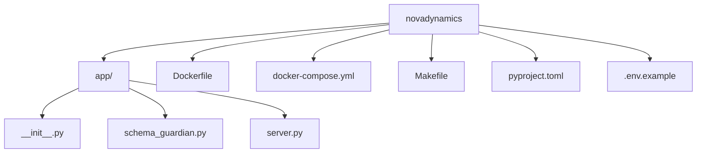

# Hello NovaDynamics — Schema Guardian

This is my solution for the technical assessment for recruiting at CMS Expert (Directus).

I add my intection with antigravity IDE and the model claude opus "Building Schema Guardian Service.md" I only had one problem whith a route on de .py but sharing the error from "docker logs -f novadynamics-app-1
and I solve it the problem

On resume, I only generated the "PROMPT_LOG.md" file and all proyect was generated automatically by antigrabity IDE and OPUS model... expose my solution in my personal computer and I test it and works fine.

I deployed this solution on my personal computer with docker LETSENCRYPT and VIRTUAL_HOST, my personal domain and works fine.

## evidence 
https://novadynamics.joses.mx/

{"status":"ok"}

https://novadynamics.joses.mx/schema_guardian

{"collection":"employee_records","total_fields":7,"fields_missing_metadata":5,"report":"# Schema Guardian Report\n\n**Collection:** employee_records\n\n**Total fields:** 7 · **Missing metadata:** 5\n\n| Field | Suggested Description |\n|---|---|\n| id | Id (uuid) |\n| user_dob | User dob (date) |\n| emergency_contact_phone | Emergency contact phone (string) |\n| last_login_audit | Last login audit (timestamp) |\n| department_id | Department id (integer) |"}

## Screenshot


## Installation

```bash
# Clone the repository
git clone https://github.com/risolerh/novadynamics.git
cd novadynamics

# Install dependencies (requires uv)
uv sync

# Copy and configure environment variables
cp .env.example .env
# Edit .env and add your OPENROUTER_API_KEY
```

## Usage

```bash
# Run the development server
make dev

# Run tests
make test

# Build Docker image
make build

# Deploy with Docker Compose
make deploy
```

### Endpoints

| Method | Path | Description |
|--------|------|-------------|
| GET | `/` | Health check — returns `{"status": "ok"}` |
| GET | `/schema_guardian` | Analyze schema and return metadata report |


## Project Structure




## License

CMS Expert (Directus) Technical Assessment for Recruiting by Jose Ricardo Soler Hernandez


